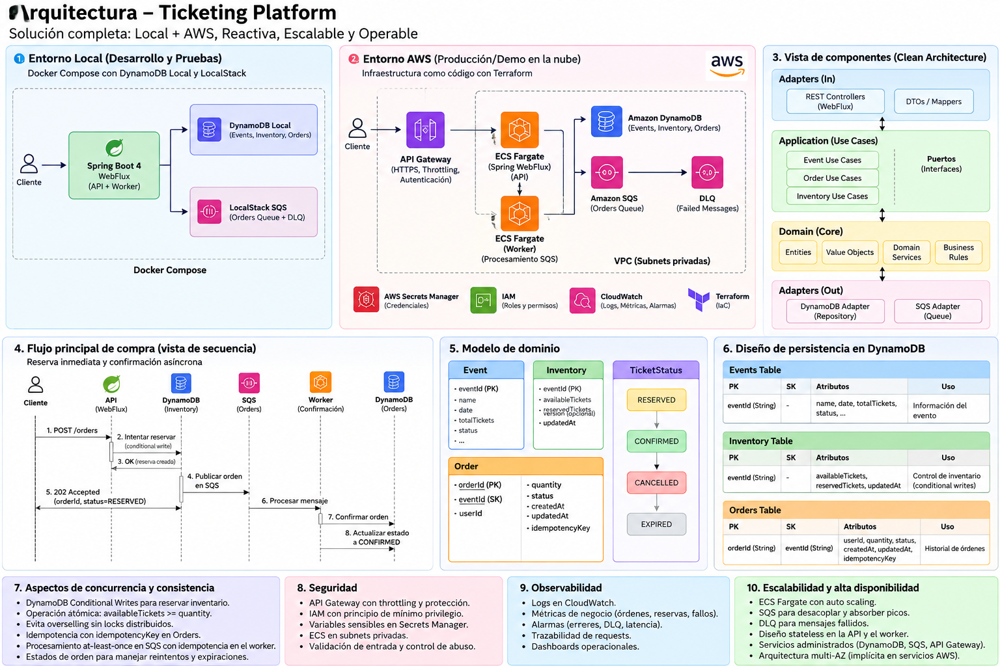

# Nequi Ticketing Platform

Microservicio de gestión de eventos, inventario, tickets y órdenes de compra, desarrollado como solución para la prueba técnica de Nequi.

La solución está diseñada bajo principios de **Clean Architecture / Hexagonal Architecture**, separación de responsabilidades y consistencia transaccional para evitar problemas como la venta de un mismo asiento a múltiples usuarios.

---

## 1. Arquitectura

La aplicación está organizada en capas:



### Componentes principales

* Java 21
* Spring Boot
* Spring Web
* Spring Validation
* AWS SDK
* Amazon DynamoDB
* Amazon SQS
* LocalStack para servicios AWS locales
* Docker / Docker Compose
* Maven

---

# 2. Funcionalidades

La solución contempla:

* Creación y consulta de eventos.
* Gestión de inventario.
* Gestión de tickets/asientos.
* Creación de órdenes.
* Idempotencia mediante `idempotencyKey`.
* Reserva temporal de asientos.
* Liberación de reservas expiradas.
* Prevención de venta del mismo asiento a múltiples personas.
* Persistencia en DynamoDB.
* Publicación de eventos mediante SQS.
* Ejecución local de servicios AWS mediante LocalStack.
* Soporte para integración posterior con AWS real.

---

# 3. Persistencia

La aplicación utiliza DynamoDB como almacenamiento principal.

Se crean las siguientes tablas:

```text
ticketing-events
ticketing-inventory
ticketing-tickets
ticketing-orders
```

## ticketing-events

| Campo   | Tipo   | Descripción              |
| ------- | ------ | ------------------------ |
| eventId | String | Identificador del evento |

Primary Key:

```text
eventId
```

---

## ticketing-inventory

| Campo   | Tipo   | Descripción              |
| ------- | ------ | ------------------------ |
| eventId | String | Identificador del evento |

Primary Key:

```text
eventId
```

---

## ticketing-tickets

Primary Key compuesta:

```text
eventId
ticketId
```

| Campo    | Tipo   |
| -------- | ------ |
| eventId  | String |
| ticketId | String |

Esto permite identificar un asiento/ticket dentro de un evento.

---

## ticketing-orders

Primary Key:

```text
orderId
```

Además, se utiliza un Global Secondary Index:

```text
idempotency-index
```

con:

```text
idempotencyKey
```

Esto permite garantizar que una misma solicitud de creación de orden no sea procesada múltiples veces.

---

# 4. Idempotencia

La creación de órdenes utiliza un `idempotencyKey`.

Ejemplo:

```http
POST /orders
Idempotency-Key: 8b7c9a7e-5a10-4a6d-b7e1-123456789abc
```

Si el cliente reintenta la misma operación utilizando el mismo `Idempotency-Key`, el sistema puede identificar que la solicitud ya fue procesada.

Esto evita la creación accidental de múltiples órdenes ante:

* reintentos HTTP;
* timeouts;
* problemas de red;
* reintentos del cliente;
* duplicación de requests.

---

# 5. Control de concurrencia de asientos

Uno de los puntos principales de la solución es evitar que un mismo asiento pueda ser vendido a múltiples personas.

El flujo conceptual es:

```text
Cliente A
   │
   │ Reserva asiento A1
   ▼
┌───────────────┐
│   DynamoDB    │
│ Conditional   │
│   Write       │
└───────┬───────┘
        │
        ▼
    RESERVED
        │
        │
        ▼
     ORDER
        │
        ▼
     SOLD
```

Cuando dos solicitudes intentan reservar el mismo asiento simultáneamente, la operación se realiza utilizando condiciones de DynamoDB para garantizar que solamente una solicitud pueda cambiar el estado exitosamente.

Ejemplo conceptual:

```text
AVAILABLE
    │
    │ conditional update
    ▼
RESERVED
```

La segunda solicitud recibe un error de condición y no puede apropiarse del asiento.

Esto evita:

```text
User A ───────┐
              ├──> Seat A1
User B ───────┘

              ❌ No permitido
```

---

# 6. Estados del ticket

Los tickets pueden manejar estados como:

```text
AVAILABLE
    │
    ▼
RESERVED
    │
PENDING_CONFIRMATION
    |
    ├───────────────┐
    │               │
    ▼               ▼
   SOLD          EXPIRED
```

### AVAILABLE

El asiento está disponible para reserva.

### RESERVED

El asiento fue reservado temporalmente mientras se completa el proceso de compra.

### PENDING_CONFIRMATION

El asiento reservado está listo para ser confirmado después de haber sido reservado

### SOLD

La orden fue completada y el asiento fue vendido.

### EXPIRED

La reserva no fue completada dentro del tiempo permitido y el asiento vuelve a estar disponible.

---

# 7. Liberación de reservas expiradas

La aplicación contiene un proceso:

```text
releaseExpiredReservations
```

Este proceso identifica reservas cuyo tiempo de expiración ya fue alcanzado y libera nuevamente los asientos.

Conceptualmente:

```text
RESERVED/PENDING_CONFIRMATION
    │
    │ expiration <= now
    ▼
AVAILABLE
```

El proceso registra logs para facilitar observabilidad:

```text
Starting expired reservations release process...
```

---

# 8. Eventos y mensajería

La solución contempla comunicación asíncrona mediante Amazon SQS.

Localmente se utiliza:

```text
LocalStack
```

para emular los servicios AWS.

Arquitectura:

```text
Application
     │
     ▼
Event Publisher
     │
     ▼
Amazon SQS
     │
     ▼
Consumer
```

Esto permite desacoplar procesos y facilita una arquitectura orientada a eventos.

---

# 9. Infraestructura local

La infraestructura local utiliza Docker Compose.

Componentes:

```text
┌───────────────────────────────────┐
│          Docker Compose           │
│                                   │
│  ┌─────────────┐                  │
│  │  DynamoDB   │                  │
│  │    Local    │                  │
│  └──────┬──────┘                  │
│         │                         │
│  ┌──────▼──────┐                  │
│  │  DynamoDB   │                  │
│  │    Admin    │                  │
│  └─────────────┘                  │
│                                   │
│  ┌─────────────┐                  │
│  │ LocalStack  │                  │
│  │     SQS     │                  │
│  └─────────────┘                  │
│                                   │
│  ┌─────────────┐                  │
│  │ Application │                  │
│  └─────────────┘                  │
│                                   │
└───────────────────────────────────┘
```

---

# 10. Requisitos

Instalar:

* Java 21
* Maven 3.9+
* Docker
* Docker Compose
* AWS CLI

Verificar:

```bash
java -version
```

```bash
mvn -version
```

```bash
docker --version
```

```bash
docker compose version
```

```bash
aws --version
```

---

# 11. Configuración de AWS CLI para DynamoDB Local

No es necesario utilizar credenciales reales de AWS para DynamoDB Local.

Se utilizan:

```bash
export AWS_ACCESS_KEY_ID=local
export AWS_SECRET_ACCESS_KEY=local
export AWS_DEFAULT_REGION=us-east-1
```

---

# 12. Levantar infraestructura

Primero iniciar DynamoDB:

```bash
docker compose up -d dynamodb
```

Verificar:

```bash
docker compose ps
```

---

# 13. Crear tablas

La creación de las tablas está automatizada mediante:

```text
docker/dynamodb/create-tables.sh
```

Dar permisos:

```bash
chmod +x docker/dynamodb/create-tables.sh
```

Ejecutar:

```bash
./docker/dynamodb/create-tables.sh
```

El script:

1. Espera a que DynamoDB esté disponible.
2. Crea las tablas.
3. Ignora tablas que ya existan.
4. Espera a que estén disponibles.
5. Muestra las tablas creadas.

---

# 14. Verificar tablas

Ejecutar:

```bash
aws dynamodb list-tables \
  --endpoint-url http://localhost:8000 \
  --region us-east-1
```

Resultado esperado:

```text
ticketing-events
ticketing-inventory
ticketing-tickets
ticketing-orders
```

---

# 15. DynamoDB Admin

DynamoDB Admin está disponible en:

```text
http://localhost:8001
```

Permite visualizar las tablas y consultar los datos almacenados en DynamoDB Local.

---

# 16. Levantar LocalStack

LocalStack se utiliza para ejecutar localmente servicios AWS, principalmente SQS.

Iniciar:

```bash
docker compose up -d localstack
```

Verificar:

```bash
docker compose ps
```

---

# 17. Ejecutar la aplicación

Para ejecutar con Maven:

```bash
./mvnw spring-boot:run
```

o:

```bash
mvn spring-boot:run
```

La aplicación estará disponible en:

```text
http://localhost:8080
```

---

# 18. Ejecutar todo con Docker

También es posible levantar toda la infraestructura y aplicación:

```bash
docker compose up -d
```

Ver logs:

```bash
docker compose logs -f app
```

---

# 19. Configuración por ambientes

La aplicación está preparada para trabajar con diferentes ambientes.

Por ejemplo:

```text
application.yml
application-local.yml
application-aws.yml
```

Localmente se utiliza:

```text
SPRING_PROFILES_ACTIVE=local
```

La configuración local apunta hacia:

```text
DynamoDB Local
LocalStack
```

En AWS se pueden utilizar los endpoints reales de:

```text
Amazon DynamoDB
Amazon SQS
```

sin modificar la lógica de negocio.

---

# 20. AWS

La solución está diseñada para poder ejecutarse sobre AWS.

Arquitectura objetivo:

```text
                    AWS
                     │
          ┌──────────┴──────────┐
          │                     │
          ▼                     ▼
     Amazon DynamoDB       Amazon SQS
          │                     │
          └──────────┬──────────┘
                     │
                     ▼
                Application
```

Para producción se recomienda utilizar:

* Amazon DynamoDB
* Amazon SQS
* AWS IAM
* Amazon CloudWatch
* AWS ECS/EKS/Lambda según estrategia de despliegue

Las credenciales deben ser administradas mediante IAM Roles, Secrets Manager o mecanismos equivalentes, evitando credenciales estáticas dentro del código.

---

# 21. Flujo de creación de una orden

El flujo principal es:

```text
POST /orders
      │
      ▼
Validate request
      │
      ▼
Check idempotency
      │
      ▼
Validate event
      │
      ▼
Reserve tickets
      │
      ▼
Conditional DynamoDB update
      │
      ├── Success
      │      │
      │      ▼
      │    Create order
      │      │
      │      ▼
      │    Publish event
      │
      └── Conditional failure
             │
             ▼
       Seat unavailable
```

---

# 22. Manejo de errores

La API utiliza respuestas HTTP apropiadas para diferentes situaciones.

Ejemplos:

```text
400 Bad Request
```

Request inválido.

```text
404 Not Found
```

Evento, ticket u orden inexistente.

```text
409 Conflict
```

Conflicto de concurrencia o asiento no disponible.

```text
500 Internal Server Error
```

Error inesperado.

---

# 23. Observabilidad

La aplicación utiliza logs para registrar operaciones importantes.

Ejemplo:

```text
Starting expired reservations release process...
```

También se recomienda registrar:

* `orderId`
* `eventId`
* `ticketId`
* `idempotencyKey`
* resultado de la operación
* errores de persistencia
* errores de mensajería

Evitar registrar información sensible.

---

# 24. Pruebas

Ejecutar:

```bash
./mvnw test
```

o:

```bash
mvn test
```

Las pruebas deben cubrir principalmente:

* creación de eventos;
* creación de tickets;
* creación de órdenes;
* idempotencia;
* reserva de asientos;
* concurrencia;
* expiración de reservas;
* liberación de tickets;
* publicación de eventos;
* errores de negocio.

---

# 25. Prueba de concurrencia

Uno de los escenarios críticos es:

```text
Request A ───────┐
                 │
                 ▼
              Seat A1
                 ▲
                 │
Request B ───────┘
```

Ambas solicitudes intentan reservar:

```text
eventId = EVENT-001
ticketId = A1
```

El sistema debe garantizar:

```text
Request A → SUCCESS
Request B → CONFLICT
```

y nunca:

```text
Request A → SUCCESS
Request B → SUCCESS
```

La garantía se implementa en la capa de persistencia utilizando operaciones condicionales de DynamoDB.

---

# 26. Estructura del proyecto

```text
src
└── main
    └── java
        └── com.nequi.ticketing
            │
            ├── application
            │   └── service
            │
            ├── domain
            │   ├── model
            │   ├── exception
            │   └── port
            │
            ├── infrastructure
            │   ├── adapter
            │   ├── persistence
            │   ├── messaging
            │   └── configuration
            │
            └── TicketingApplication.java
```

La intención es mantener el dominio independiente de frameworks e infraestructura.

---

# 27. Principios utilizados

La solución sigue principalmente:

* Clean Architecture
* Hexagonal Architecture
* SOLID
* Domain Driven Design
* Separation of Concerns
* Dependency Inversion
* Idempotency
* Event Driven Architecture
* Defensive programming
* Cloud-native principles

---

# 28. Decisiones técnicas

### DynamoDB

Se utiliza por su capacidad de escalamiento horizontal, baja latencia y soporte de operaciones condicionales necesarias para controlar concurrencia.

### SQS

Permite desacoplar procesos y manejar comunicación asíncrona.

### LocalStack

Permite desarrollar y probar integraciones AWS localmente.

### DynamoDB Local

Permite ejecutar la persistencia localmente sin depender de una cuenta AWS durante el desarrollo.

### Docker

Permite reproducir el entorno de ejecución de manera consistente.

---

# 29. Consideraciones para producción

En un ambiente productivo se recomienda:

* DynamoDB administrado por AWS.
* SQS administrado por AWS.
* IAM Roles para autenticación.
* CloudWatch para logs y métricas.
* Alarmas y métricas sobre errores.
* DLQ para mensajes fallidos.
* Retención y monitoreo de mensajes.
* Auto Scaling cuando aplique.
* Infrastructure as Code utilizando Terraform o AWS CDK.
* Secrets Manager / Parameter Store para configuración sensible.

---

# 30. Quick Start

Para ejecutar rápidamente el proyecto:

```bash
docker compose up -d dynamodb localstack
```

Luego:

```bash
./docker/dynamodb/create-tables.sh
```

Después:

```bash
./mvnw spring-boot:run
```

Aplicación:

```text
http://localhost:8080
```

DynamoDB Admin:

```text
http://localhost:8001
```

---

# 31. Estado de la solución

La solución está orientada a demostrar:

```text
Clean Architecture
        +
AWS
        +
DynamoDB
        +
SQS
        +
Idempotency
        +
Concurrency Control
        +
Event Driven Architecture
```

El objetivo principal es garantizar que el sistema pueda manejar correctamente operaciones concurrentes de reserva y compra de tickets manteniendo consistencia e idempotencia.

# 32. Pruebas de API

Una vez levantada la aplicación:

```bash
./mvnw spring-boot:run
```

la API estará disponible en:

```text
http://localhost:8080
```

> Los ejemplos siguientes asumen que la aplicación está ejecutándose localmente.

---

## 32.1 Crear un evento

Crear un evento de prueba:

```bash
curl --location --request POST 'http://localhost:8080/api/v1/events' \
--data '{
  "name": "Nequi Live",
  "date": "2026-12-15T20:00:00Z",
  "venue": "Bogota Arena",
  "totalCapacity": 10
}'
```

Respuesta esperada:

```json
{
  "id": {
    "value": "76b41d09-e383-4a21-bfa4-3f52eb0fd1bd"
  },
  "name": "Nequi Live",
  "date": "2026-12-15T20:00:00Z",
  "venue": "Bogota Arena",
  "totalCapacity": 10
}
```

---

## 32.2 Consultar un evento

```bash
curl --location \
'http://localhost:8080/api/v1/events/{eventId}"'
```

Respuesta esperada:

```json
{
  "eventId": {
    "value": "76b41d09-e383-4a21-bfa4-3f52eb0fd1bd"
  },
  "totalTickets": 10,
  "availableTickets": 10,
  "reservedTickets": 0,
  "soldTickets": 0,
  "complimentaryTickets": 0,
  "version": 0
}
```

---

## 32.3 Consultar disponibilidad

Consultar los tickets disponibles para un evento:

```bash
curl --location \
'http://localhost:8080/api/v1/events/{eventId}/availability'
```

Ejemplo de respuesta:

```json
[
  {
    "id": {
      "value": "A-003"
    },
    "eventId": {
      "value": "76b41d09-e383-4a21-bfa4-3f52eb0fd1bd"
    },
    "status": "AVAILABLE",
    "orderId": null,
    "reservedUntil": null
  },
  {
    "id": {
      "value": "A-004"
    },
    "eventId": {
      "value": "76b41d09-e383-4a21-bfa4-3f52eb0fd1bd"
    },
    "status": "AVAILABLE",
    "orderId": null,
    "reservedUntil": null
  }
]
```
---
## 32.4 Consultar eventos disponibles

Para consultar los eventos disponibles, que tengan ticketes disponibles y que su fecha no esté vencida

```bash
curl --location 'http://localhost:8080/api/v1/events/availables'
```

Respuesta esperada:

```json
[
    {
        "id": {
            "value": "76b41d09-e383-4a21-bfa4-3f52eb0fd1bd"
        },
        "name": "Nequi Live",
        "date": "2026-12-15T20:00:00Z",
        "venue": "Bogota Arena",
        "totalCapacity": 10
    },
    {
        "id": {
            "value": "264d0d77-73af-4aa4-af8f-42566593246b"
        },
        "name": "Concierto vallenato",
        "date": "2026-10-04T20:00:00Z",
        "venue": "Estadio de beisbol Monteria",
        "totalCapacity": 100
    }
]
```

---

# 33. Crear una orden

Para crear una orden se utiliza un `Idempotency-Key`.

```bash
curl --location --request POST 'http://localhost:8080/api/v1/orders' \
--header 'Content-Type: application/json' \
--header 'Idempotency-Key: ORDER-REQUEST-001' \
--data '{
  "eventId": "76b41d09-e383-4a21-bfa4-3f52eb0fd1bd",
  "ticketIds": [
    "A-001",
    "A-002"
  ],
  "userId": "CUSTOMER-001"
}'
```

Respuesta esperada:

```json
{
  "orderId": "cae5dd7b-468a-4dee-9aa8-76d14766c014",
  "eventId": "76b41d09-e383-4a21-bfa4-3f52eb0fd1bd",
  "userId": "CUSTOMER-001",
  "ticketIds": [
    "A-001",
    "A-002"
  ],
  "quantity": 2,
  "status": "RESERVED",
  "createdAt": "2026-10-03T17:40:09.727858Z",
  "updatedAt": "2026-10-03T17:40:09.727858Z",
  "reservationExpiresAt": "2026-10-03T17:50:09.727858Z"
}
```

Los tickets pasan de:

```text
AVAILABLE
```

a:

```text
RESERVED
```

Y un proceso garantiza la entrega de estos por patron producer/consumer a través de una cola sqs.
dejando la orden en:

```text
PENDING_CONFIRMATION
```

---

# 34. Consultar una orden

```bash
curl --location \
'http://localhost:8080/api/v1/orders/{orderId}'
```

Respuesta esperada:

```json
{
  "orderId": "cae5dd7b-468a-4dee-9aa8-76d14766c014",
  "eventId": "76b41d09-e383-4a21-bfa4-3f52eb0fd1bd",
  "userId": "CUSTOMER-001",
  "ticketIds": [
    "A-001",
    "A-002"
  ],
  "quantity": 2,
  "status": "PENDING_CONFIRMATION",
  "createdAt": "2026-10-03T17:40:09.727858Z",
  "updatedAt": "2026-10-03T17:40:09.891143Z",
  "reservationExpiresAt": "2026-10-03T17:50:09.727858Z"
}
```

---

# 35. Confirmar una orden

Una vez realizado el proceso de compra, la orden puede ser completada.

```bash
curl --location --request POST \
'http://localhost:8080/api/v1/orders/{orderId}/confirm'
```

Respuesta esperada:

```json
{
  "orderId": "ORDER-001",
  "status": "COMPLETED"
}
```

Los tickets asociados a la orden pasan de:

```text
PENDING_CONFIRMATION
```

a:

```text
SOLD
```

De esta manera, una orden completada es la que finalmente asigna los asientos vendidos al comprador.

---

# 36. Prueba de idempotencia

Este es uno de los escenarios importantes de la solución.

Ejecutar la misma petición dos veces utilizando el mismo `Idempotency-Key`.

### Primera petición

```bash
curl --location --request POST 'http://localhost:8080/api/v1/orders' \
--header 'Content-Type: application/json' \
--header 'Idempotency-Key: IDEMPOTENCY-001' \
--data '{
  "eventId": "EVENT-001",
  "ticketIds": [
    "A3"
  ],
  "customerId": "CUSTOMER-001"
}'
```

La solicitud crea la orden.

### Segunda petición

Ejecutar exactamente la misma petición:

```bash
curl --location 'http://localhost:8080/api/v1/orders' \
--header 'Content-Type: application/json' \
--header 'Idempotency-Key: IDEMPOTENCY-001' \
--data '{
  "eventId": "EVENT-001",
  "ticketIds": [
    "A3"
  ],
  "customerId": "CUSTOMER-001"
}'
```

El sistema debe reconocer que:

```text
Idempotency-Key = IDEMPOTENCY-001
```

ya fue procesado.

No debe crear una segunda orden.

---

# 37. Prueba de concurrencia

Este es uno de los escenarios más importantes de la prueba técnica.

Supongamos que:

```text
EVENT-001
TICKET = A10
```

está disponible.

Dos clientes intentan comprar simultáneamente el mismo asiento.

### Cliente A

```bash
curl --location 'http://localhost:8080/api/v1/orders' \
--header 'Content-Type: application/json' \
--header 'Idempotency-Key: CLIENT-A-001' \
--data '{
  "eventId": "EVENT-001",
  "ticketIds": [
    "A10"
  ],
  "customerId": "CUSTOMER-A"
}'
```

### Cliente B

```bash
curl --location 'http://localhost:8080/api/v1/orders' \
--header 'Content-Type: application/json' \
--header 'Idempotency-Key: CLIENT-B-001' \
--data '{
  "eventId": "EVENT-001",
  "ticketIds": [
    "A10"
  ],
  "customerId": "CUSTOMER-B"
}'
```

Las dos solicitudes pueden ejecutarse prácticamente al mismo tiempo.

El resultado esperado es:

```text
Client A → SUCCESS
Client B → 409 CONFLICT
```

o viceversa.

Lo importante es que **solamente una solicitud consiga reservar el asiento**.

El sistema nunca debe producir:

```text
Client A → SUCCESS
Client B → SUCCESS
```

para el mismo:

```text
eventId = EVENT-001
ticketId = A10
```

---

# 38. Ejecutar prueba de concurrencia desde terminal

En sistemas Unix/macOS se puede ejecutar:

```bash
(
  curl --location 'http://localhost:8080/api/v1/orders' \
  --header 'Content-Type: application/json' \
  --header 'Idempotency-Key: CONCURRENT-A' \
  --data '{
    "eventId": "EVENT-001",
    "ticketIds": ["A20"],
    "customerId": "CUSTOMER-A"
  }'
) &

(
  curl --location 'http://localhost:8080/api/v1/orders' \
  --header 'Content-Type: application/json' \
  --header 'Idempotency-Key: CONCURRENT-B' \
  --data '{
    "eventId": "EVENT-001",
    "ticketIds": ["A20"],
    "customerId": "CUSTOMER-B"
  }'
) &

wait
```

Esto dispara las dos solicitudes de forma concurrente.

El resultado esperado es que solamente una pueda reservar `A20`.

---

# 39. Verificar el ticket después de una reserva

Consultar:

```bash
curl --location \
'http://localhost:8080/api/v1/events/EVENT-001/tickets/A20'
```

El ticket debería encontrarse en:

```text
RESERVED
```

y asociado a una única orden.

---

# 40. Completar la orden

Si la orden ganadora fue:

```text
ORDER-001
```

ejecutar:

```bash
curl --location --request POST \
'http://localhost:8080/api/v1/orders/ORDER-001/cormimr'
```

El ticket pasa a:

```text
SOLD
```

---

# 41. Verificar que el asiento fue vendido

```bash
curl --location \
'http://localhost:8080/api/v1/events/EVENT-001/tickets/A20'
```

Respuesta esperada:

```json
{
  "eventId": "EVENT-001",
  "ticketId": "A20",
  "status": "SOLD",
  "orderId": "ORDER-001"
}
```

Esto demuestra que el asiento quedó asociado a una única orden.

---

# 42. Prueba de reserva expirada

Una reserva que no es completada dentro del tiempo configurado debe ser liberada.

Flujo:

```text
AVAILABLE
    │
    ▼
RESERVED
    │
    │ timeout
    ▼
AVAILABLE
```

Para verificar el proceso se pueden consultar los logs:

```bash
docker compose logs -f app
```

o, si se ejecuta con Maven:

```bash
./mvnw spring-boot:run
```

Se debe observar el proceso:

```text
Starting expired reservations release process...
```

Después de la expiración, el ticket debe volver a:

```text
AVAILABLE
```

---

# 43. Prueba de error: ticket no disponible

Intentar reservar un ticket que ya está vendido:

```bash
curl --location 'http://localhost:8080/api/v1/orders' \
--header 'Content-Type: application/json' \
--header 'Idempotency-Key: SOLD-TICKET-001' \
--data '{
  "eventId": "EVENT-001",
  "ticketIds": [
    "A20"
  ],
  "customerId": "CUSTOMER-003"
}'
```

Respuesta esperada:

```text
409 Conflict
```

El sistema no debe crear una nueva orden ni modificar el estado del ticket.

---

# 44. Flujo completo recomendado para demostrar la solución

Para realizar una demostración de la prueba técnica se recomienda ejecutar las operaciones en este orden:

```text
1. Crear evento
       │
       ▼
2. Crear / cargar tickets
       │
       ▼
3. Consultar disponibilidad
       │
       ▼
4. Crear orden
       │
       ▼
5. Tickets → RESERVED
       │
       ▼
6. Consultar orden
       │
       ▼
7. Completar orden
       │
       ▼
8. Tickets → SOLD
       │
       ▼
9. Intentar comprar nuevamente
       │
       ▼
10. 409 CONFLICT
```

También se recomienda demostrar independientemente:

```text
Idempotency
     │
     ▼
Same Idempotency-Key
     │
     ▼
No duplicate order
```

y:

```text
Concurrency
     │
     ├── Client A ──┐
     │              │
     │            Seat A1
     │              │
     └── Client B ──┘
                    │
                    ▼
             Only one succeeds
```

Estos escenarios son los que mejor evidencian las garantías de consistencia e idempotencia implementadas en la solución.

---

